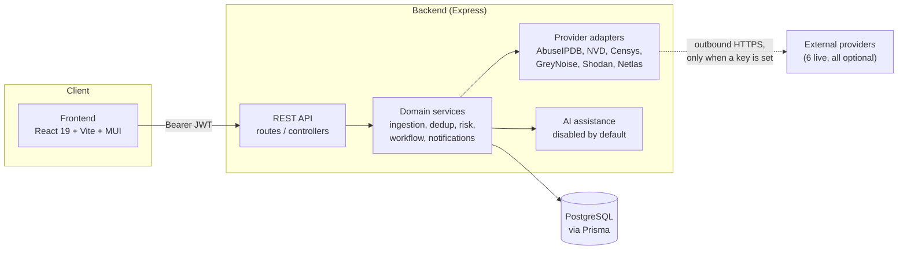

# Technical Architecture

This is the authoritative technical architecture document for ThreatNeXus, written for a reviewer,
new engineer, or auditor who needs to understand how the system actually works. It describes what is
built, not what was planned — `docs/ai/ARCHITECTURE.md` is a shorter internal orientation note for the
AI development team; this document supersedes it in detail and is the one to read first.

ThreatNeXus is a defensive cyber-threat-intelligence orchestration and incident-response **research
prototype**, built during an internship with PKCERT/NCERT. It has never been deployed and has never
held real constituent data. See `docs/PROJECT_PLAYBOOK.md` for the non-technical framing (what it is
and is not) and `docs/DEPLOYMENT.md` for how to run it.

## System overview



The frontend never talks to a provider or to Postgres directly — everything goes through the backend
REST API, and the backend is the only authorization boundary (see [Trust boundaries](#trust-boundaries)
below).

## Components and ownership

| Component | Path | Notes |
|---|---|---|
| REST API | `backend/src/routes`, `backend/src/controllers` | Everything mounted under `/api` |
| Domain services | `backend/src/services` | Ingestion, dedup, enrichment, risk, workflow, notification, mapping, AI assistance |
| Provider adapters | `backend/src/services/{enrichment,vulnerability,exposure,reputation}` | AbuseIPDB, NVD/KEV/EPSS, Censys, GreyNoise, Shodan, Netlas |
| Persistence | `backend/prisma` | Prisma + PostgreSQL, **23 migrations, all additive** — no migration in this history has ever altered or dropped a column |
| Evaluation harness | `eval/` | Drives the real services against a disposable database and hand-authored ground truth (9 gates, 2 more manual mutation/concurrency gates) |
| Analyst UI | `frontend/src` | React 19 · Vite (rolldown/oxc) · MUI v9 · React Router 7 · GSAP for motion. No charting library — every figure is a number or a table, never a fabricated chart |
| Browser exit gate | `frontend/e2e` | Playwright, Chromium only, against the real stack (9 spec files) |
| CI | `.github/workflows/ci.yml` | See `docs/TESTING_AND_CI.md` |

## Backend module map

```
backend/src/
  app.js                  Express app assembly — every router mounted here
  server.js               HTTP listener entry point
  config/                 env.js (startup validation), prisma.js, rateLimiters.js
  middleware/              authMiddleware, requireRole (capability guard), requestContext,
                           errorHandler, normalizeMulterError
  lib/                    roles.js (capability model), validation.js
  routes/  + controllers/ One pair per resource group — see the table in
                           docs/PROVIDER_GUIDE.md for the provider routes specifically
  services/
    ingestion/             CSV parsing, row validation, dedup/persistence/recurrence
    ownership/              Asset/organization ownership resolution
    enrichment/             IOC reputation (AbuseIPDB/mock), queue, provider registry
    vulnerability/          NVD/KEV/EPSS association and enrichment
    exposure/               Censys, Shodan, Netlas (internet-exposure providers)
    reputation/              GreyNoise (internet-noise provider)
    risk/                   Deterministic Risk v1 scoring engine
    workflow/               Case lifecycle, closure, recurrence reopening
    notification/           Drafting, revisions, review, export, delivery tracking
    mapping/                ATT&CK / NIST CSF / CIS framework mapping
    ai/                     Case-level AI mapping-suggestion assistance (Phase 5)
    aiAssist/               Finding-level AI summary/explanation drafts (Phase 8C)
    dashboard/               operationalOverviewService.js — the one read-only snapshot
    auditService.js         safeLogAuditEvent — every write path's audit hook
```

## Data flow

Report upload → CSV structural validation → per-row validation → dedup on
`(indicator_value, port, protocol, report_type)` → a `Finding` is created, or an existing one is
bumped (**persistence**, same finding still open) or reopened (**recurrence**, same finding seen again
after closure) → IOC reputation enrichment (AbuseIPDB or mock) and, on request, exposure/vulnerability
enrichment from the six live providers → deterministic Risk v1 score with stored per-factor
contributions → analyst triage → organization-bound `Case` → evidence gathering → reviewer-approved
closure (a *different* person than the requester) → notification draft → immutable revision →
reviewer-approved review bound to that exact revision → manual `.eml` export → manually recorded
delivery observation.

The dashboard (`GET /api/dashboard/overview`) reads **one bounded, read-only snapshot** and performs no
provider lookup of its own — every figure returned is `{ value, availability, source, asOf }`, so a
figure the caller may not read is `RESTRICTED` (not zero) and a figure whose query failed is
`UNAVAILABLE` (not zero). Nothing on the dashboard is ever fabricated to fill a gap.

## Provider adapter pattern

Every live provider (Censys, GreyNoise, Shodan, Netlas — AbuseIPDB and NVD predate the pattern but
follow the same shape) is built from four files:

1. **`<provider>Types.js`** — closed status/error-code taxonomy and one validated result constructor
   (`createExposureResult`/equivalent). Every field is bounds-checked; nothing upstream is trusted
   verbatim.
2. **`<provider>Config.js`** — pure bounds/defaults for base URL and timeout, shared between startup
   validation and the provider factory so the two can never disagree about what "valid" means.
3. **`<provider>Provider.js`** — the actual HTTP adapter. Composed timeout + caller-abort signal, every
   HTTP/transport outcome mapped to a normalized result, never throws for an *expected* outcome
   (disabled, rate-limited, not found, malformed, unreachable, timeout — all first-class results, not
   exceptions).
4. **`<provider>ExecutionService.js`** — the audited orchestration: validate → audit `attempted` → call
   the provider → persist the terminal row → audit the outcome. No queue: every provider-execution call
   in this codebase is synchronous and human-triggered.

Full behavior per provider — env vars, failure modes, evidence fields, security boundary — is in
`docs/PROVIDER_GUIDE.md`.

## AI assistance flow

Two independent AI assistance surfaces exist, both **disabled by default** and both structurally unable
to make a decision — see `docs/AI_GOVERNANCE.md` for the full governance model:

- **Case-level mapping suggestions** (Phase 5) — candidate ATT&CK/CSF/CIS mappings for a case.
- **Finding-level narrative drafts** (Phase 8C) — summary/explanation text for one Finding.

Both share the same shape: a provider factory resolves to a `disabled` provider unless `AI_ENABLED=true`
and a real `AI_PROVIDER` is configured (no live AI provider ships in this repository — only `disabled`
and a test-only `mock`, and `mock` can never be resolved in production code); a suggestion is inert data
until a human reviewer accepts or rejects it; accepting a mapping suggestion promotes it through the
exact same write path a manual mapping uses, so the AI path can never obtain authority the manual path
denies.

## Evidence semantics

Every stored intelligence result — enrichment, vulnerability association, risk factor, mapping — carries
enough provenance to answer "why does the system say this?" without asking a human to remember. The
Risk v1 explanation is the clearest example: it renders entirely from stored `RiskFactorContribution`
rows, and each factor's applicability is one of three values, never collapsed:

- `APPLIED` — real evidence was scored, including a legitimate zero
- `NOT_AVAILABLE` — the evidence could not be obtained (a provider failure is not silently "clean")
- `NOT_APPLICABLE` — the factor cannot apply to this kind of finding

The same discipline applies to the dashboard (`RESTRICTED` vs `UNAVAILABLE` vs a real zero), to provider
enrichment (`SKIPPED_DISABLED`/`RATE_LIMITED`/`FAILED` are distinct, persisted outcomes, not silently
retried into a different answer), and to framework mappings (a mapping cites a verbatim stored quote and
a separate confidence value; ATT&CK specifically requires *observed adversary behaviour* as evidence —
exposure, CVE, KEV, EPSS, reputation and risk score are each individually insufficient and the rule is
enforced server-side, not just in the UI).

## Audit, rate-limit and auth model

- **Authentication**: `Authorization: Bearer <JWT>`, issued at login, containing only `{ id, email,
  role }`. No database lookup on every request — a role change takes effect on the next login, not
  immediately (documented limitation, not a bug).
- **Authorization**: capability-based, not role-ranked. See `docs/ADMIN_GUIDE.md` for the full
  role/capability matrix. The backend is the only enforcement point; the frontend's own capability
  checks (`frontend/src/utils/permissions.js`) are presentation convenience only and are kept honest
  against the backend by a dedicated test, not by trust.
- **Audit**: `safeLogAuditEvent` is called from every write path. A failed audit write never blocks the
  operation it is auditing — but it is itself logged. Audit summaries are allow-listed fields only:
  never a raw request body, a provider key, or a raw upstream response.
- **Rate limiting** (Phase 7): three independent buckets — auth (login/register), upload, and provider
  execution. All six live providers share the **same** provider-execution budget; a caller cannot get a
  bigger effective quota by switching providers. See `docs/PROVIDER_GUIDE.md` and
  `docs/OPERATIONS_RUNBOOK.md`.

## Trust boundaries

**The backend is the only authorization boundary.** Frontend permission checks are presentation only —
hiding a control grants and denies nothing. Every route enforces its own capability check server-side
and fails closed: an unrecognized role in a token resolves to *no* capabilities, not to `VIEWER`.

## Docker / CI / evaluator design

- **Docker Compose** brings up PostgreSQL, backend and frontend for local development or a
  demonstration — there is no production compose file, and `JWT_SECRET` has no default (the stack
  refuses to start without it). See `docs/DEPLOYMENT.md`.
- **CI** (`.github/workflows/ci.yml`) runs on every push: a secrets/artifact hygiene check, a Prisma
  schema/migration-history check, the backend suite against real PostgreSQL, frontend lint/test/build,
  the Chromium browser suite, and 9 core evaluators. Two mutation/concurrency gates are manual-dispatch
  only (they take minutes, not seconds). See `docs/TESTING_AND_CI.md`.
- **Evaluators** (`eval/`) are a separate concept from unit/integration tests: each one drives the real
  production services end-to-end against a disposable database and asserts against hand-authored ground
  truth, not mocked expectations. They exist for the phases with the highest cost of a silent
  regression (ingestion/dedup, risk scoring, workflow, notifications, framework mapping, ownership,
  vulnerability evidence, offline/no-key startup). The six live-provider phases (8B–8F) are covered by
  their own dedicated unit/integration test suites instead of a phase evaluator, because each is an
  isolated adapter addition, not a cross-cutting workflow change.

## Data model

See `backend/prisma/schema.prisma` directly for the full model — this section names the load-bearing
relationships, not every column.

- **`Finding`** is the dedup unit: one row per `(indicator_value, port, protocol, report_type)`. An
  `occurrenceCount` bump means "seen again while already open"; a status transition back to `OPEN` from
  a closed state is a **recurrence**, and it reopens the associated `Case` and audits the reopening.
- **`Finding` → `Case` → `Notification`** is the analyst-facing chain: a case is bound to one
  organization, gathers evidence against one or more findings, and can produce zero or more notification
  drafts, each with its own immutable revision history.
- **Provider result tables are one per provider domain, never shared.** `IocEnrichment` (AbuseIPDB),
  `VulnerabilityProviderResult` (NVD/KEV/EPSS), `CensysEnrichment`, `GreyNoiseEnrichment`,
  `ShodanEnrichment`, `NetlasEnrichment` — each has its own columns shaped to what that provider actually
  returns, rather than forcing every provider through one generic "enrichment" table. This is a
  deliberate, repeated architectural choice (see `docs/ai/SECURITY.md` for the reasoning behind each
  one) — a materially different response shape gets its own table rather than a nullable bolt-on.
- **`RiskScore` + `RiskFactorContribution`** are append-only: `currentForFindingId` is a nullable unique
  pointer to the one current score per Finding, so history is never deleted, only superseded.
- **`AuditLog`** is append-only and is written from every service-layer write path, not from
  controllers, so a service that forgets to call it fails a test rather than silently omitting an entry.

## Frontend architecture

- **Routing** (`frontend/src/App.jsx`): one entry per route in `APP_ROUTES`, pairing a path with the
  single capability that gates it (`frontend/src/utils/permissions.js`). Sidebar navigation and
  `ProtectedRoute` both read the same table, so a page's visibility and its guard can never drift apart
  on the frontend — and the backend re-checks independently regardless.
- **Pages**: Dashboard, Findings (+ detail), Upload, Cases (+ detail), Notifications (+ detail),
  Analytics, AttackNavigator, Organizations, Settings, Profile, Login.
- **Design system**: MUI v9 with a near-black, government-green identity; no charting library, no map
  library — status is always icon + word + color, never a fabricated visualization. Motion is GSAP,
  restrained, disabled entirely under `prefers-reduced-motion`.
- **State**: no global state library. Each page fetches what it needs from the REST API directly; the
  dashboard is the one screen backed by a single aggregate snapshot endpoint.

## Known architectural limitations

These are carried forward honestly, not smoothed over:

- **Finding closure has no production write path.** `RawReportRow`/`Finding.status = CLOSED` is never
  written by any route in `src/` — the recurrence-reopening engine reads that state correctly, but
  nothing reachable through the UI or API produces it in this build. Proven only by `eval:phase1` and
  `eval:phase3` driving the services directly. See `docs/DEMO_SCRIPT.md` for how this is handled in a
  live demonstration.
- **No user-management UI or endpoint.** Accounts are created only by `npm run seed:users` or a direct
  database change. See `docs/ADMIN_GUIDE.md`.
- **No token revocation.** A role change or account disablement does not take effect until the
  existing JWT expires (`JWT_EXPIRES_IN`, default 24h).
- **A generic legacy `Threat`/`/api/threats` surface still exists** alongside the Finding model — see
  `docs/API_CONTRACT_PHASE0.md` for its (still-accurate) behavior. It predates Phase 1 and is not part
  of the Shadowserver ingestion workflow.
- **No SIEM/EDR integration, no automatic notification sending, no automatic remediation verification,
  no threat-actor attribution.** All out of scope by design — see `docs/PROJECT_PLAYBOOK.md` § Scope.
