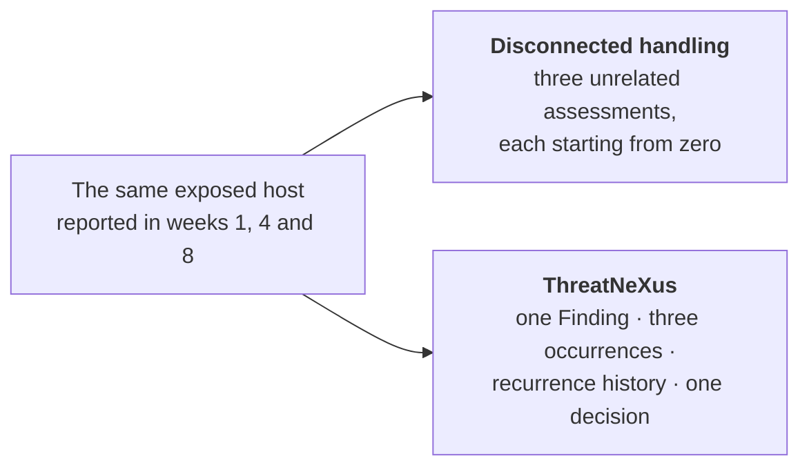
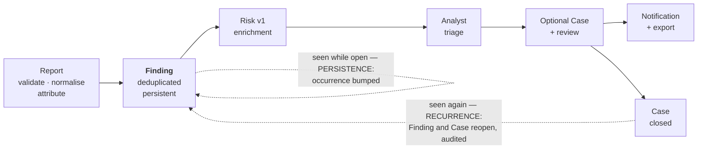
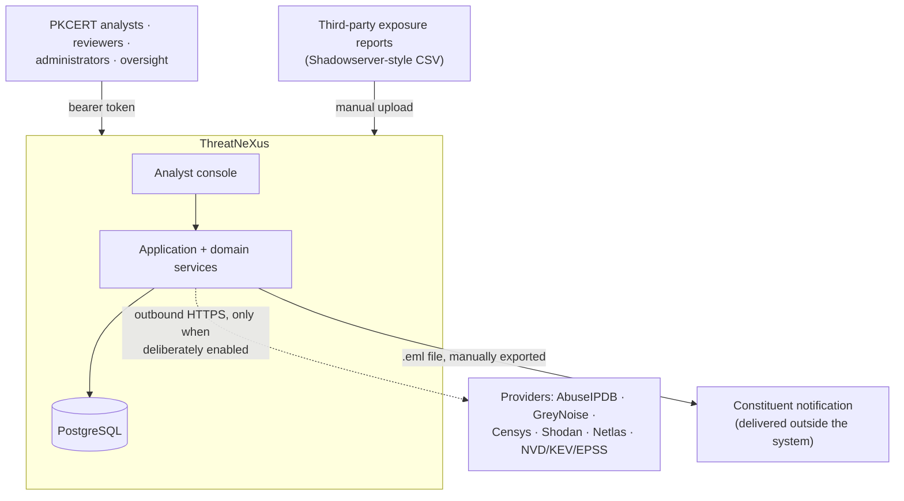
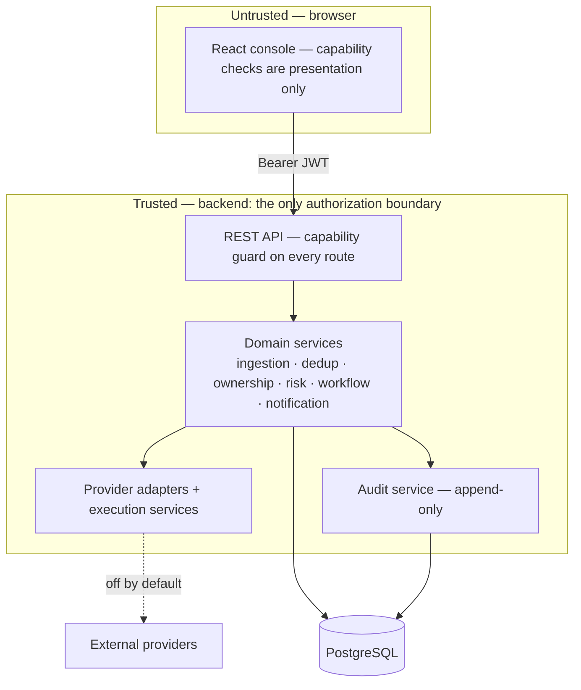
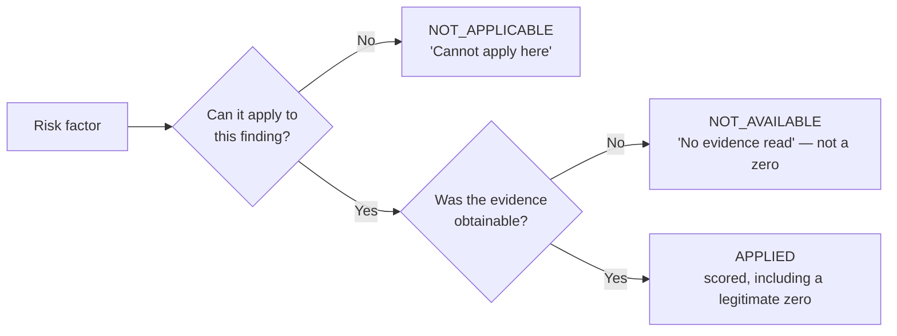
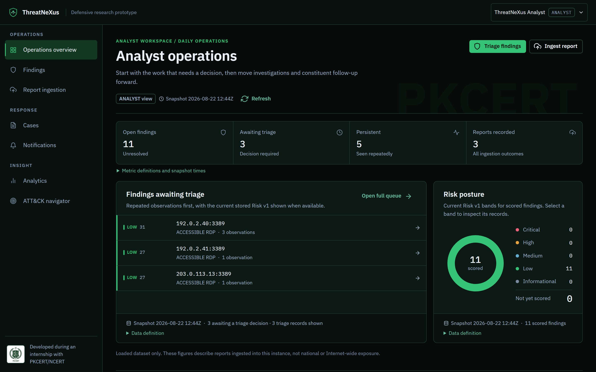
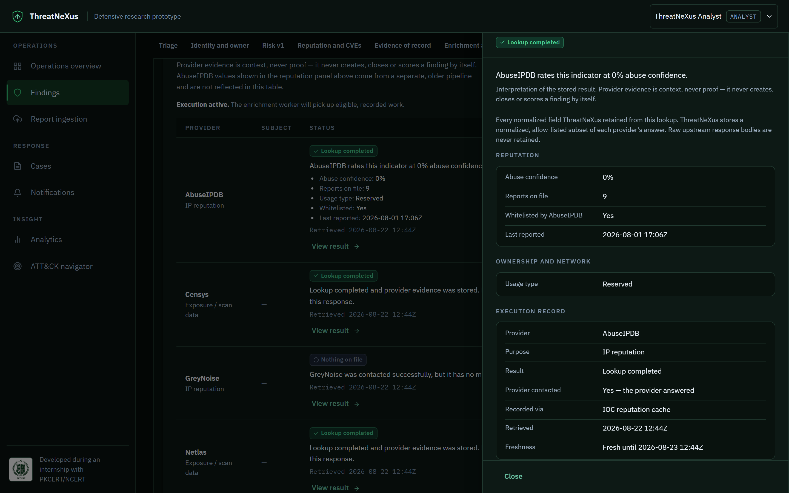

# ThreatNeXus

## Evidence-Driven Threat Intelligence & Exposure Analysis for PKCERT

**Official System & Handover Document**

| | |
|---|---|
| **Version** | 1.0 · 2026-08-22 |
| **Repository state** | `fd804ea` (`origin/main`) |
| **Status** | **Submitted for evaluation** |
| **Formal institutional approval** | Not claimed. No PKCERT adoption, approval or deployment decision is made or implied by this document. |
| **Deployment status** | Research prototype. Never deployed; has never held real constituent data. |

**Project team.** M. Ismail — Threat Intelligence and System Coordination · Ali Haider — Software
Engineering and Backend Systems · Aun Zulfiqar — Frontend and User Experience · Eshaal Khan —
Security Workflow and Quality Assurance. Developed during an internship with PKCERT/NCERT.

**How to read this.** Sections 1–5 assume no prior knowledge and are written for a reader deciding
whether the system deserves evaluation. Sections 6–13 are for engineering and security staff.
Section 14 records limitations and is deliberately in the body, not an appendix. Every claim is
traceable to the repository at the commit above or to a dated evidence record inside it; where
something is an engineering judgement rather than a measurement, it says so.

---

# 1. Executive summary

A national CERT receives third-party reports describing hosts in its constituency reachable from the
internet in ways they probably should not be. Each report is a file. Handled by hand, each file is a
fresh start: the same exposed host is re-read, re-identified and re-assessed repeatedly, without
anyone being able to say whether it was fixed, whether it came back, or who owns it.

ThreatNeXus converts recurring exposure observations into **persistent, attributed, explainable
Findings** that carry their own history, giving an analyst a bounded path from received report to
auditable decision. Its design commitments are deliberately conservative:

- **A Finding has memory.** The same exposure seen again bumps an occurrence or reopens a closed
  case; it does not become an unrelated row.
- **Unknown is not zero.** A factor with no evidence renders as *no evidence read*, never a zero that
  flatters the score.
- **Provider evidence is context, not proof.** It never creates, closes or scores a Finding.
- **Analyst authority is preserved.** Nothing automated approves a closure or a notification. Export
  is not delivery.
- **No silent outbound behaviour.** Every provider is off by default; every core workflow completes
  with no external network access.

**Implemented.** One report family — Accessible RDP exposure — carried end to end: ingestion,
deduplication, persistence and recurrence, constituent attribution, deterministic Risk v1 scoring,
controlled multi-provider enrichment, analyst triage, case workflow with independent review, and
notification drafting, approval and manual export, across four roles with genuinely different
authority, on an append-only audit trail.

**Not implemented.** Not a SIEM, not an internet scanner, not an autonomous responder, not a
notification delivery platform. Not deployed, no real constituent data, no independent penetration
test.

**Standing.** 3,730 automated tests pass against real PostgreSQL at the commit above, zero failures. A
bounded internal security assessment found one critical, one high and one medium issue; all three
fixed and re-tested, two advisory items open by decision. ThreatNeXus is a credible candidate for
**bounded PKCERT evaluation and pilot use**, subject to the deployment prerequisites in section 12 —
principally TLS, which is a recommendation here and not a shipped feature.

---

# 2. The operational problem

ThreatNeXus addresses a class of operational problem relevant to national CERT workflows. Nothing
here asserts a deficiency in current PKCERT practice.

**The problem is not the exposure. It is the disconnection.** That organisations have exposed RDP is
not the hard part; exposure is discoverable and third parties report it. The hard part is that
exposure reports arrive as *disconnected observations*. A file lands containing addresses, ports and
timestamps, and nothing in it knows what an analyst concluded last week about the same address.

Without a persistent workflow an analyst repeatedly has to ingest and validate the report, work out
which constituent an indicator belongs to, determine whether the exposure is new or has returned
after closure, establish whether the evidence changed, gather corroborating intelligence, assess risk
consistently with previous assessments, decide whether action is warranted, build an investigation
trail someone else can follow, prepare a notification, and preserve provenance and personal
accountability throughout.

Because the report has no memory, **a recurring exposure looks like a brand-new event** even when it
is the same unresolved condition reported a month ago. The costs compound:

| Consequence | Cause |
|---|---|
| Duplicated analyst effort | Triage reasoning reconstructed from scratch each time |
| Weak recurrence awareness | Nothing distinguishes *new*, *still open* and *returned after closure* |
| Inconsistent prioritisation | Same evidence weighed differently by different analysts, or on different days |
| Fragmented evidence | Provider lookups live in browser tabs, not against the record |
| Poor provenance | "Why do we believe this?" depends on recollection |
| Difficult handover | The investigation lives partly in a person |
| Weak auditability | The decision is recorded; the reasoning and evidence often are not |
| Missing evidence read as reassurance | A failed lookup renders as a clean result |

The last row is the most consequential and least visible. A system showing `0` when it means *we
could not find out* does not merely omit — it misinforms the decision.

The disconnected path is not wrong; it is memoryless. Each observation is handled competently and
independently, and the relationship between them exists only in the analyst's head.

---

# 3. Why common approach categories leave this gap open

Each category below is useful and widely deployed. The point is not deficiency — it is that this
workflow is not what they are shaped for. ThreatNeXus is **complementary** to all of them and
replaces none.

| Approach | Strength | Why the gap remains |
|---|---|---|
| Raw report / spreadsheet | Simple input | Observations stay disconnected; recurrence history hard to preserve operationally |
| Dashboard | Visibility of current state | Shows what is true now without creating persistent investigation memory |
| SIEM | Event collection and correlation at scale | Event- and log-centric; does not by itself provide this external-exposure-to-Finding lifecycle |
| Threat intelligence platform | Intelligence management and sharing | Intelligence context alone does not supply constituent attribution, recurrence-aware Findings, deterministic operational risk and case/notification workflow |
| API aggregator | Multiple providers in one place | Aggregation without evidence lifecycle, provenance and analyst decisions becomes another dashboard |
| Automated scanner | Discovers exposure directly | Raises scanning authority, scope and legal questions; solves discovery, not disposition |
| Autonomous response | Speed | Inappropriate where national CERT analyst authority and evidentiary judgement must stay human-controlled |

A SIEM could be made to implement much of this, and so could a TIP with enough custom work. The claim
is narrower: this workflow is what ThreatNeXus is *for*, integrated rather than assembled per
deployment.

---

# 4. What ThreatNeXus is

> ThreatNeXus turns recurring exposure evidence into persistent, attributed and scored Findings that
> analysts can triage and, where necessary, progress into auditable investigations.

It consumes external exposure reports. It does not produce them and it does not scan.

Two points matter more than the boxes. **Not every Finding becomes a Case** — triage is a real
decision and most Findings are expected to end there; a Case is opened deliberately when
investigation is warranted. **Enrichment is not automatic** — in the shipped default nothing contacts
a provider until an analyst asks, and the ask is budgeted and recorded.

**What "Accessible RDP" means.** Evidence that a Remote Desktop Protocol service was reachable at a
given address and port at a given time. It does **not** mean the host is compromised, malicious,
vulnerable, weakly-passworded or breached. It means it answered, and everything the system says about
that host is bounded by that.

**Deduplication, persistence, recurrence.** The dedup key is
`(indicator_value, port, protocol, report_type)`; one Finding exists per key.

| Situation | Result |
|---|---|
| Key not seen before | New `Finding` created |
| Key seen again while open | **Persistence** — occurrence count bumped, no new row |
| Key seen again after closure | **Recurrence** — Finding reopens, associated Case reopens, reopening audited |

This is the mechanism behind "a Finding has memory" — the difference between a report that restates a
problem and a record that tracks one.

---

# 5. Differentiation, and why PKCERT might evaluate it

No individual row below is novel in the industry. The differentiation is the **combination**, holding
together in one workflow rather than being assembled per deployment.

| Dimension | Typical report / dashboard workflow | ThreatNeXus |
|---|---|---|
| Persistent entity | Isolated observation | Persistent Finding |
| Recurring exposure | Repeats as new rows | Occurrences build recurrence and persistence history |
| Attribution | Often indicator-centric | Constituent attribution where evidence supports it, method recorded |
| Risk | Opaque, manual or vendor-supplied | Deterministic Risk v1, stored inspectable factor contributions |
| Missing information | Collapses to empty or zero | Unknown is not zero — distinct, named states |
| External enrichment | Unlimited, manual or ad-hoc | Controlled, budgeted, audited, off by default |
| Provider evidence | Easily read as conclusion | Context, never proof; cannot score or close a Finding |
| Case escalation · human authority | Disconnected; increasingly automated | Deliberate progression into Cases; analyst and reviewer authority preserved structurally |
| Notification · outbound behaviour | Output can imply delivery; often implicit | Export explicitly distinct from delivery; nothing leaves without a deliberate act |
| Auditability | Varies | Decisions and lifecycle on an append-only trail |

### 5.1 Why it is relevant to PKCERT

Each item is supported by implemented behaviour, not intent. ThreatNeXus **reduces repeated analyst
work**, because recurring exposure retains history rather than restarting from zero; **preserves
evidence provenance**, since each stored result records what was asked, of whom, when and what came
back; **supports consistent prioritisation** through a deterministic, inspectable score; **preserves
analyst authority**, assisting evidence handling without making institutional decisions; **creates an
auditable investigation path** from Finding through triage, optional Case, independent review and
notification to export; **controls external enrichment**, explicitly and auditably rather than as
uncontrolled background traffic; **treats recurrence as an operational signal** rather than repeated
noise; **supports constituent-centric work**; **provides a reusable base for broader report
families**, though each new family still needs its own parser and semantics — real work that is not
done; and **improves handover**, because state, provenance and triage history persist so a second
analyst does not reconstruct the investigation manually.

ThreatNeXus is a credible candidate for bounded PKCERT evaluation and pilot use, not for immediate
operational dependence.

### 5.2 Why not just use the provider websites?

AbuseIPDB, Censys, GreyNoise, Shodan and Netlas are valuable, and ThreatNeXus is not valuable because
it duplicates them — it does not. Their evidence becomes one contextual input into a controlled
workflow. **The providers answer questions about an indicator; ThreatNeXus manages what that evidence
means operationally for an analyst** — against a persistent Finding, with attribution, recurrence
history, a deterministic score, a triage decision, an optional investigation, a review step and an
audit trail. It also records the lookup itself: what was asked, when, under whose authority, and
against which budget. Provider evidence remains context, not proof.

### 5.3 Why not just use a SIEM?

SIEMs are valuable for security event and log collection, correlation and monitoring, and a SIEM can
certainly be extended toward this workflow. ThreatNeXus addresses a narrower lifecycle: external
report → persistent Finding → recurrence → attribution → explainable risk → controlled intelligence
context → analyst decision → investigation and notification. The two are complementary.

### 5.4 Why this is more than a demonstration build

ThreatNeXus was designed as an operational system prototype rather than a visual dashboard or an API
demonstration: a persistent domain model across 44 entities and 25 additive migrations; explicit
recurrence semantics and provenance on every stored result; deterministic risk with per-factor
storage; a provider execution path with attempt records, budget reservations and audited outcomes;
structural human-authority boundaries and capability-based authorization; an append-only audit trail;
case and review workflow; export-is-not-delivery semantics; a bounded security assessment with applied
remediation; deterministic demonstration reset and preflight tooling; measured production-sizing
evidence; one controlled live provider canary; and tested negative and failure states. It has not been
deployed to production, and this document does not claim otherwise.

---

# 6. System context and architecture

Two boundaries are load-bearing. The dashed line carries no traffic in the default configuration. The
line to constituent notification is a **file**, not a transmission — there is no SMTP or webhook
client anywhere in the codebase.

**The backend is the only authorization boundary.** Frontend permission checks hide controls for
usability; hiding a control grants and denies nothing. Every route enforces its own capability check
server-side and fails closed — an unrecognised role in a token resolves to *no* capabilities, not to
read-only.

**Stack.** React 19 · Vite · MUI v9 · React Router 7 in the console; Node.js and Express in the
application; Prisma ORM over PostgreSQL 16 for persistence (44 models, 25 additive migrations);
packaged as Docker Compose. There is deliberately **no charting or map library** — every figure on
screen is a number or a table with a stated source and snapshot time, so no visualisation can imply
precision or coverage the data lacks.

**Roles.** Four roles hold **disjoint** authority rather than nested seniority, so none inherits
another's power. VIEWER has read-only oversight; ANALYST adds ingestion, triage, case work and
notification drafting; REVIEWER adds independent approval of closures and notification revisions;
ADMIN holds every capability. The separation that matters operationally: **the person who requests a
case closure cannot approve it, and the person who drafts a notification cannot approve it** —
enforced server-side, and demonstrated in the seeded data where an analyst's self-approval attempt is
refused with a `403`.

---

# 7. Ingestion and attribution

Ingestion is transparent about refusals: a structurally invalid report, an out-of-range port or a
failed row produces a **named reason code**, not a silent drop. It is the only untrusted-file surface
in the system and is treated accordingly (section 11).

Ownership attribution resolves deterministically in a fixed order — explicit analyst override, then
exact address match, then longest matching address range, then ASN. The method actually used is stored
and displayed with a confidence indicator, so an analyst can see *why* a host was attributed to a
constituent rather than being asked to trust it.

---

# 8. Risk and the truth model

Risk v1 (`risk-additive-bucketed-v1`, v1.0.0) is **deterministic and explainable, and never
AI-generated**. The same stored evidence always yields the same score. The explanation shown is not
prose written about the score — it renders from the stored per-factor contribution rows that produced
it. Each factor carries one of three applicability states, never collapsed into one another:

The distinction between `NOT_AVAILABLE` and an applied zero is the point. A provider that could not be
reached has told you nothing; rendering that as `0` converts a gap in knowledge into apparent
reassurance. The same discipline runs through the dashboard, where a figure the caller may not see is
`RESTRICTED` and one whose query failed is `UNAVAILABLE` — neither is a zero. Risk scores are
append-only: a new score supersedes the previous through a nullable "current" pointer, and history is
never deleted.

Framework mapping follows the same discipline. Mappings to ATT&CK, NIST CSF and CIS are made manually
and cite a verbatim stored quote plus a separate confidence value. **ATT&CK specifically requires
observed adversary behaviour as evidence** — exposure, a CVE, a KEV listing, an EPSS score, reputation
data and a risk score are each individually insufficient, and the rule is enforced server-side, not
only in the interface.

---

# 9. Controlled enrichment

Enrichment is the part of the system most capable of doing something unwanted — spending money,
contacting third parties, or revealing what PKCERT is investigating. It therefore carries the most
controls.

A request passes four gates in order. Each gate that refuses records a **named decision**, not a
silent no-op, and each is shown to the analyst with its reason:

| Gate, evaluated in order | Recorded outcome if it refuses |
|---|---|
| Does this provider support this subject type? | `SKIPPED_UNSUPPORTED_SUBJECT` |
| Is a credential configured for it? | `SKIPPED_NOT_CONFIGURED` |
| Does a fresh result already exist, and was force not requested? | `SKIPPED_CACHED` |
| Is there daily budget left for this lane? | `SKIPPED_BUDGET` |
| **All four pass** | Reserve budget → audit *attempted* → **exactly one** provider call → normalise and allow-list → persist terminal outcome → audit result |

"Nothing happened" is therefore never indistinguishable from "nothing was found".

| Provider | Purpose | Credential |
|---|---|---|
| AbuseIPDB | IP reputation | Required |
| GreyNoise | Internet background noise / scanner classification | Required |
| Censys · Shodan · Netlas | Exposure and scan data | Required |
| NVD | Vulnerability data (CVE) | Optional key |
| CISA KEV | Known exploited vulnerability catalogue | None |
| FIRST EPSS | Exploit prediction scoring | None |

Vulnerability enrichment (NVD, KEV, EPSS) is a **separate path** from IOC reputation enrichment.
Neither substitutes for the other, and the system does not treat a vulnerability signal as a
reputation signal or the reverse.

**What is stored.** ThreatNeXus does **not** retain complete raw upstream response bodies. It stores a
**normalised, allow-listed subset** of each provider's answer, shaped per provider — each provider
domain has its own table rather than being forced through one generic structure. This has a direct
consequence for what the interface can honestly show, and the interface says so: the Provider
Intelligence Evidence viewer exposes exactly the stored normalised evidence. Where a provider answered
successfully but contributed no analyst-facing fields, the viewer says *that*, rather than implying
the lookup failed. Opening the viewer is **read-only and performs zero provider calls**.

**Budget and accounting.** Enrichment runs in two lanes — MANUAL (an analyst asked) and AUTOMATIC
(ingestion scheduled it) — with independent daily budgets per provider per lane. Budget is *reserved*
before the call and the reservation recorded, so an interrupted call cannot be spent twice. All live
providers additionally share one provider-execution rate-limit bucket, so a caller cannot obtain a
larger effective quota by rotating providers. The default posture ships with automatic enrichment off,
the worker off, and every budget at zero.

---

# 10. Analyst workflow and human authority

Navigation groups by what the analyst is doing rather than by which subsystem owns the data:
**Operations** (overview, findings, report ingestion), **Response** (cases, notifications), **Insight**
(analytics, ATT&CK navigator) and **Administration** (organizations, settings). Roles see only the
groups their capabilities support.

*Figure 1 — Analyst operations overview. Every figure carries its own snapshot time and a "loaded
dataset only" qualifier. The dashboard performs no provider lookup of its own.*

Finding Detail is **decision-first**: the triage decision and the evidence bearing on it come first,
while historical material — observation timeline, case citations — sits under a secondary *Evidence of
record* grouping. Case Detail and Notification Detail use the same progressive disclosure, so
accumulated history does not crowd out the current decision. Dashboard entrance motion is
session-bounded rather than replayed on every navigation.

*Figure 2 — The Provider Intelligence Evidence viewer. Each provider row's one-line summary is a
preview; the drawer shows the stored normalised evidence and the execution record — what was asked, of
whom, whether the provider actually answered, when, and how long the result stays fresh. Opening it
performs no provider call.*

**Safety boundaries** are structural properties, not policies relying on discipline.

| Boundary | How it holds |
|---|---|
| Separation of duties | Closure and notification approval refused for the requester, server-side |
| Export is not delivery | Export produces an `.eml` file; no SMTP or webhook client exists. Delivery is recorded afterwards as a manual observation of a human act |
| AI cannot decide | Both AI surfaces off by default; a suggestion is inert data until a human accepts it, and acceptance travels the same write path a manual entry uses |
| Provider evidence cannot score | No provider result creates, closes or scores a Finding |
| Nothing leaves silently | Every provider off by default; every core workflow completes with no outbound access |
| Every write is audited | `AuditLog` is append-only and written from the service layer, so a service that omits an audit fails a test |

AI assistance is easy to overstate, so precisely: two surfaces exist — case-level framework mapping
suggestions and finding-level narrative drafts. Both are disabled by default. **No live AI provider
ships in this repository.** Neither can approve, send, score, close or resolve anything, and every
core workflow completes with AI off.

---

# 11. Security architecture and assessment

Authentication is a bearer JWT carrying only identity, email and role. Authorization is
**capability-based rather than role-ranked**, enforced per route on the server. Independent
introspection of the running router enumerated **99 mounted routes**, of which exactly **3** are
unauthenticated (service root, login, register) and exactly **1** is authenticated but capability-free
(profile) — matching the documented exception list exactly. Rate limiting runs in three independent
buckets: authentication, upload and provider execution. Public self-registration is **closed by
default in every environment, tests included**.

A single **bounded, authorised, non-destructive application-security assessment** was performed on
2026-08-18 against a disposable local stack, every provider credential empty and verified empty inside
the running container. This is an internal engineering assessment. **It is not a certification, was
not performed by an independent third party, and does not claim the absence of vulnerabilities.**

| ID | Severity | Surface | Status |
|---|---|---|---|
| SEC-01 | **P0** critical | Anonymous self-registration exposed all constituent data | **Fixed** |
| SEC-02 | **P1** high | Every HTML document served without security headers | **Fixed** |
| SEC-03 | **P2** medium | Out-of-range resource ids returned 500 on 13 routes | **Fixed** |
| SEC-04 | P3 advisory | `X-Powered-By` header disclosed | Deferred |
| SEC-05 | P3 advisory | Prisma CLI declared a runtime dependency (not runtime-reachable) | Deferred |

SEC-01 arose from two individually correct decisions: read-only oversight legitimately requires a
VIEWER to read findings and cases, and registration legitimately cannot demand a credential the caller
lacks. Together they meant anyone who could reach the API could mint an account carrying
organizational read authority. The fix closes registration by default and refuses before any field
parsing or password hashing, so the closed door is neither an account-existence oracle nor a way to
make the server do work.

**Negative evidence recorded.** 23 authorization probes across four roles, a self-registered account
and unauthenticated access — all correctly refused. Forged JWTs (`alg:none`, wrong key, expired,
payload tampered to ADMIN) rejected identically. Ten hostile CSV files — formula injection, XSS
payloads, oversized fields, NUL bytes, path traversal in the filename — each produced a distinct
controlled refusal with nothing written outside the upload directory. Login responds uniformly for
unknown and wrong-password. No secret-shaped value appeared in the served bundle, server logs, or 141
audit rows.

**Residual risk.** Accounts created while registration was open remain valid — closing it is not
retroactive, so an operator should audit the user table before relying on the fix. The CSP omits
`script-src` and `connect-src` because the API origin is chosen at build time, leaving XSS mitigation
to React's escaping and the verified absence of HTML sinks. The rate limiter is in-process. Sessions
are bearer tokens in `localStorage` with a 24-hour default and no server-side revocation. SEC-04 and
SEC-05 remain open by decision.

**Assessment limitations.** One reviewer, one pass, no second audit cycle. DAST and SAST were
deliberately not run — a coverage limitation as well as a choice. Testing was non-destructive: no
resource exhaustion, no concurrency exploitation, no fuzzing beyond the bounded corpus. No live
provider integration was exercised, so provider *response* handling was verified only against
fixtures. Absence of a finding is not proof of absence of a vulnerability.

---

# 12. External intelligence, provenance and deployment

### 12.1 What external data was and was not obtained

This record exists so no reader infers availability from the absence of data in the repository.

**Shadowserver Foundation.** External access was pursued; support ticket reference `#7ibziiin` is on
record, and approval from the competent authority was a required precondition. The project team
reports that Shadowserver responded to the inquiry, that the project supervisor was supportive
throughout, and that the related access request did not receive the required internal approval.
**Shadowserver data and API access are therefore not available project inputs.** The repository holds
no Shadowserver data, API client, scheduler or credential field — live scheduled ingestion was never a
runtime dependency and is recorded as out of scope.

**Rapid7 / Project Sonar.** The project team reports a Rapid7 Open Data request submitted as **Ticket
#140718 on 2026-08-11**, with a subsequent follow-up. As at the record date of 2026-08-19, **no
dataset, access grant or report had been received.** No Rapid7 adapter, client or configuration
surface exists in the repository.

Neither is a software limitation, and neither is a runtime dependency — the pipeline consumes a report
file and is indifferent to who produced it.

**The data actually used** is synthetic and deterministic throughout development, testing, evaluation
and demonstration, drawn only from ranges reserved for documentation and benchmarking
(`192.0.2.0/24`, `198.51.100.0/24`, `203.0.113.0/24`, `198.18.0.0/15`), with ground truth committed
alongside it. The CSV contract `accessible-rdp.synthetic.v1` is a **project-defined format modelled on
the shape of** Shadowserver-style reports, not an official Shadowserver schema.

Two rules must be preserved in any future document. **Scanner-source addresses and exposed-RDP
destination hosts are opposite ends of the same interaction** — a reputation provider reports on an
address *performing* activity, an exposure report enumerates addresses *exposing* a service — and must
never be merged in any figure or count. And **no figure from this system may be presented as national
cyber exposure statistics**; every view describes the loaded dataset only.

### 12.2 The one live provider contact

Exactly one live provider call has ever been made, under bounded human authorisation: **GreyNoise
Community** against `1.1.1.1` (a benign, already-approved in-repo smoke subject), MANUAL lane, daily
budget of exactly one reservation, pre-live preflight **17 / 17 PASS**, exactly one provider contact,
outcome `NOT_FOUND` / HTTP 404 / job `NO_RECORD` / run `SUCCEEDED`. The worker was returned to off and
the disposable database destroyed. No key value appears anywhere in the repository.

`NOT_FOUND` was a complete success: the canary proved the accounting and execution path — reservation,
single contact, audited sequence, truthful terminal state — not anything about the subject. **It is not
evidence of large-scale live operation.**

### 12.3 Deployment: current, proposed, future

Nothing in the "proposed" or "future" columns exists in the repository.

| Aspect | Current (dev / demo) | Proposed pilot | Future / HA |
|---|---|---|---|
| Topology | Compose: PostgreSQL + backend + frontend, one host | Same, private network or VPN | Replicas behind a load balancer |
| TLS | **None.** `http://localhost`; no terminator exists | **Required**, via reverse proxy | Managed certificates |
| Database | Same host, Docker volume | Dedicated volume or managed PostgreSQL 16 | Replication / managed HA |
| Registration | Closed by default | Closed; accounts via seed script | User-management UI |
| Secrets | `JWT_SECRET` required, no default | Injected from environment, never committed | Secret manager |
| Provider egress | None required; all off | Outbound HTTPS only if deliberately enabled | Same |
| Rate limiting | In-process | In-process; adequate single-process | Shared store required |
| Monitoring | Container stdout + audit log | Same; external monitoring unbuilt | Centralised aggregation and alerting |
| Backup | `pg_dump`, manual | Automated dumps, 10× retention | Backup **and restore verification** |
| Retention | **Not implemented**; accumulates indefinitely | A decision a pilot must make | Policy-driven expiry |

Everything in the pilot and future columns is a recommendation. Migrations (`prisma migrate deploy`,
25 additive) are unchanged across all three. Restore has never been tested.

**Sizing.** *Measured* means directly observed on the recorded host; *reasoned* means derived from a
measurement plus a stated assumption and headroom.

| Tier | vCPU | RAM | Storage | Basis |
|---|---|---|---|---|
| A — dev / demonstration | 2 | 4 GB | 20 GB SSD | Measured idle floor under 100 MiB across all three containers; measured startup peak 167.9 MiB |
| B — PKCERT pilot | 4 | 8 GB | 100 GB SSD | Measured startup peak ≈ 3.2 cores; storage from measured growth of ≈ 4.9 KB per new Finding, ≈ 1.2 KB per later observation |
| C — recommended production | 4 | 8–16 GB | 250 GB SSD | Reasoned; **no load test supports a higher or lower number** |
| D — future / HA | — | — | — | Proposed and unimplemented in every respect |

**Deliberately not offered:** concurrent-analyst capacity, requests per second, sustained ingestion
throughput, availability targets, and any national-scale figure. No concurrency or load test has been
performed. Measured single-request ingestion was 500 rows in 41–57 seconds — a measurement, not a
throughput claim.

---

# 13. Validation evidence

| Evidence | Result | Classification |
|---|---|---|
| Backend tests at `fd804ea` | **3,730 passed · 2 skipped · 0 failed**, 170 files, 211.9 s, real PostgreSQL 16 | MEASURED — local run, project host |
| CI baseline at `2612cbc` | 3,460 passed · 240 skipped · 0 failed | MEASURED — CI, dated |
| CI baseline at `ee1146b` | 3,417 passed · 240 skipped · 0 failed | MEASURED — CI, dated |
| Evaluator gates | 9 core gates in CI; 2 further mutation/concurrency gates on manual dispatch | MEASURED |
| Browser exit gate | Chromium suite against the real stack | MEASURED |
| Security assessment | 3 findings fixed and re-tested; 2 advisory deferred | MEASURED — single internal pass |
| Live provider canary | 1 contact, 17/17 preflight, truthful terminal state | MEASURED — one bounded run |
| Production sizing | Tiers A–D | MEASURED footprint; REASONED recommendations |
| Load / concurrency behaviour | — | **NOT LOAD-TESTED** |

The higher pass count at `fd804ea` relative to the CI baselines reflects roughly 238 previously-skipped
suites executing because a real test database was supplied, plus new tests from subsequently merged
work. CI on dedicated infrastructure remains the authoritative pass/fail signal for this repository.

**Evaluators are not unit tests.** Each drives the real production services end to end against a
disposable database and asserts against hand-authored ground truth committed alongside the data —
deduplication counts, recurrence counts and risk scores are compared against a file, not a mock.

---

# 14. Current limitations

Stated in the body, because a limitation found after adoption is worth less to an evaluator than one
found before it. Each gives the limitation, then the reason, then the future path.

**Accessible-RDP is the only implemented ingestion family.** The downstream Finding, risk, case and
notification architecture is report-type agnostic, but each additional family needs its own parser and
semantics. *Future:* SSH, SMB, VNC, FTP/Telnet, WinRM, VPN and administrative interfaces, and exposed
database services are **planned directions, not supported capabilities.**

**Not an internet scanner.** ThreatNeXus consumes exposure evidence produced elsewhere and performs no
discovery — which also means it inherits no scanning authority or legal question. This is a deliberate
boundary, not a gap to close.

**No autonomous remediation, and export is not delivery.** Export produces a file; whether it reached
anyone is recorded afterwards as a human observation. Delivery infrastructure would create an outbound
capability a CERT should authorise separately, so it would be a distinct, separately-reviewed
component.

**Provider enrichment depends on configured external services.** With no credentials the system starts
normally and every core workflow completes, recording a truthful not-configured outcome. Provider
availability, quota and terms are outside the system's control.

**Raw upstream provider responses are not retained** — only a normalised allow-listed subset, so an
analyst needing the full upstream answer must go to the provider. Storing arbitrary third-party
payloads would expand both the data-protection surface and the parsing attack surface.

**Finding closure has no production write path.** The recurrence-reopening engine reads closed state
correctly, but no route reachable through the interface or API currently writes it; recurrence is
proven by evaluators driving the services directly, not through the console.

**No user-management interface** — accounts come from a seed script or a direct database change, and
`manage:users` exists as a capability but is unrouted. **No token revocation** — a role change takes
effect at next login, up to the 24-hour token lifetime. **A legacy generic threat surface still
exists** alongside the Finding model, predating the current workflow and not part of it.

**No real constituent data has ever been processed**, there is **no production deployment**, and there
has been **no independent third-party penetration test**. **No retention policy exists** — data
accumulates indefinitely, and a pilot must decide this rather than configure it.

---

# 15. Adoption path and handover

The appropriate next step is a **bounded pilot**, not operational dependence:

1. **Technical evaluation.** Stand the stack up from the repository on an isolated host; confirm the
   test suite and evaluator gates pass in PKCERT's own environment.
2. **Resolve deployment prerequisites.** TLS termination, a private network boundary, secret injection,
   and a backup *and restore* procedure — restore has never been tested and should be proven before any
   real data exists.
3. **Decide retention.** There is no policy and no expiry job; this is a governance decision.
4. **Pilot on a limited constituency.** Confirm constituent attribution behaves acceptably against real
   ownership data, which synthetic data cannot prove.
5. **Independent security review.** The internal assessment is a starting point, not a substitute.
6. **Then decide** whether broader use is warranted, and which additional report families justify the
   parser work.

| Handover item | Location |
|---|---|
| Source, migrations, tests, evaluators | Repository at `fd804ea` |
| Architecture · providers | `docs/ARCHITECTURE.md` · `docs/PROVIDER_GUIDE.md` |
| Deployment · operations · roles | `docs/DEPLOYMENT.md` · `docs/OPERATIONS_RUNBOOK.md` · `docs/ADMIN_GUIDE.md` |
| Security assessment | `docs/security/FINAL-SECURITY-ASSESSMENT.md` |
| External data · canary · sizing records | `docs/evidence/` |
| Demonstration · screenshot masters | `docs/demo/DEMO-READINESS.md` · `docs/assets/screenshots/final/` |

ThreatNeXus does not claim to solve threat intelligence. It addresses one specific, recurring
operational problem — that exposure reports arrive without memory — and addresses it in a way that
keeps the analyst in authority and the system honest about what it does and does not know.

Most exposure reports end where the analyst's work begins. ThreatNeXus starts there.

The system is offered for evaluation. No claim of PKCERT approval, adoption or deployment is made or
implied by this document.
